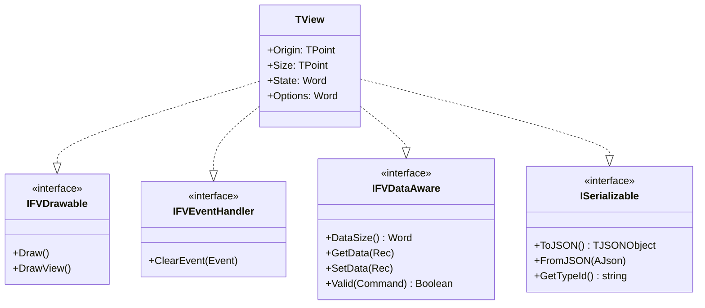
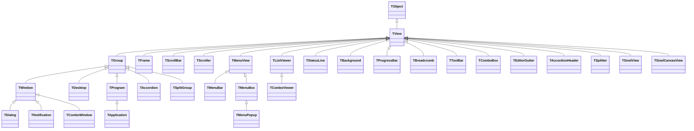
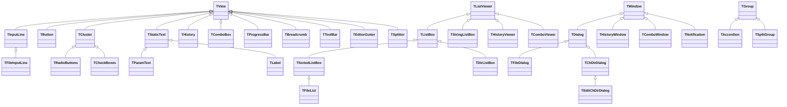
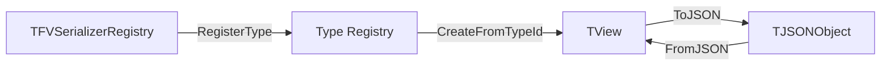

# Free Vision Modern - Architecture

This document describes the architecture of the modernized Free Vision framework for Delphi 12+.

## Overview

Free Vision Modern is a text-mode UI framework that provides a complete widget toolkit for console applications. It follows a classic Model-View-Controller-inspired design with a hierarchical view system.

```
+------------------------------------------------------------------+
|                         TApplication                              |
|  +------------------------------------------------------------+  |
|  |  TMenuBar                                                   |  |
|  +------------------------------------------------------------+  |
|  |  TToolBar                                                   |  |
|  +------------------------------------------------------------+  |
|  |                        TDesktop                             |  |
|  |  +------------------+  +------------------+  +-----------+  |  |
|  |  |    TWindow       |  |    TDialog       |  |TNotificat.|  |  |
|  |  |  +-----------+   |  |  +-----------+   |  | (toast)   |  |  |
|  |  |  | TScroller |   |  |  | TButton   |   |  +-----------+  |  |
|  |  |  +-----------+   |  |  +-----------+   |                 |  |
|  |  +------------------+  +------------------+                 |  |
|  +------------------------------------------------------------+  |
|  |  TStatusLine                                                |  |
|  +------------------------------------------------------------+  |
+------------------------------------------------------------------+
```

## Layer Architecture

```
+------------------------------------------------------------------+
|                    Application Layer                              |
|         App.pas: TApplication, TProgram, TDesktop                |
+------------------------------------------------------------------+
|                     Widget Layer                                  |
|    Dialogs.pas: TDialog, TButton, TInputLine, TListBox, etc.     |
|    Menus.pas: TMenuBar, TMenuBox, TStatusLine                    |
|    Editors.pas, ColorSel.pas, Outline.pas, Tabs.pas              |
|    ProgressBar, Breadcrumb, ToolBar, ComboBox, Splitter,         |
|    Accordion, EditorGutter, Notification, SIXEL/ImageView,        |
|    SpinnerView, TaskProgress, CheckListBox                        |
+------------------------------------------------------------------+
|                      View Layer                                   |
|         Views.pas: TView, TGroup, TWindow, TFrame                |
+------------------------------------------------------------------+
|                    Driver Layer                                   |
|         Drivers.pas: Event queue, keyboard, mouse                |
|         FVScreen.pas: Console output, VT/SGR, Sixel              |
|                       (consults FVProfile for downsampling)      |
+------------------------------------------------------------------+
|                   Foundation Layer                                |
|         Objects.pas: TFVStream, string helpers                   |
|         FVCommon.pas: Platform types                             |
|         FVClipboard.pas: Windows clipboard bridge                |
|         FVInterfaces.pas: Interface definitions                  |
|         FVUnicodeWidth.pas: Unicode 15.1 cell-width tables       |
|         FVUTF8.pas: UTF-8 codec + width (delegates to above)     |
|         FVProfile.pas: Terminal capability profile               |
+------------------------------------------------------------------+
```

## Interface Hierarchy

All view classes implement these interfaces for consistent behavior:



### Interface Details

| Interface | Purpose | Key Methods |
|-----------|---------|-------------|
| `IFVDrawable` | Rendering capability | `Draw`, `DrawView` |
| `IFVEventHandler` | Event handling | `ClearEvent` |
| `IFVDataAware` | Data binding for dialogs | `GetData`, `SetData`, `Valid` |
| `ISerializable` | JSON persistence | `ToJSON`, `FromJSON`, `GetTypeId` |

**Note**: Reference counting is disabled (`_AddRef`/`_Release` return -1) so views are managed manually, not by interface references.

## Class Hierarchy

### Core View Hierarchy



### ASCII Diagram: Core Views

```
TObject
    |
    +-- TView (implements IFVDrawable, IFVEventHandler, IFVDataAware, ISerializable)
          |
          +-- TGroup (container for child views)
          |     |
          |     +-- TWindow (framed, moveable window)
          |     |     |
          |     |     +-- TDialog (modal dialog)
          |     |     +-- TNotification (auto-dismissing toast)
          |     |     +-- TComboWindow (combo dropdown popup)
          |     |
          |     +-- TDesktop (main application area)
          |     |
          |     +-- TAccordion (collapsible section stack)
          |     |
          |     +-- TSplitGroup (split panel container)
          |     |
          |     +-- TProgram (application base)
          |           |
          |           +-- TApplication (full application with video init)
          |
          +-- TFrame (window frame decoration)
          |
          +-- TScrollBar (horizontal/vertical scrollbar)
          |
          +-- TScroller (scrollable content area)
          |
          +-- TListViewer (abstract list display)
          |     |
          |     +-- TComboViewer (combo dropdown list)
          |
          +-- TMenuView (menu base)
          |     |
          |     +-- TMenuBar (horizontal menu bar)
          |     +-- TMenuBox (dropdown menu)
          |           |
          |           +-- TMenuPopup (context menu)
          |
          +-- TStatusLine (bottom status bar)
          |
          +-- TBackground (desktop background)
          |
          +-- TProgressBar (visual progress indicator)
          |
          +-- TBreadcrumb (clickable path navigation)
          |
          +-- TToolBar (horizontal button bar)
          |
          +-- TComboBox (dropdown select trigger)
          |
          +-- TEditorGutter (multi-column editor gutter)
          |
          +-- TAccordionHeader (collapsible section header)
          |
          +-- TSplitter (draggable panel divider)
          |
          +-- TSixelView (pre-encoded SIXEL surface)
          |
          +-- TSixelCanvasView (direct pixel-drawing SIXEL canvas)
```

### Dialog Controls Hierarchy



### ASCII Diagram: Dialog Controls

```
TView
    |
    +-- TInputLine (text input field)
    |     |
    |     +-- TFileInputLine (file path input)
    |
    +-- TButton (clickable button)
    |
    +-- TCluster (group of options)
    |     |
    |     +-- TRadioButtons (single selection)
    |     +-- TCheckBoxes (multiple selection)
    |
    +-- TStaticText (label/text display)
    |     |
    |     +-- TParamText (parameterized text)
    |     +-- TLabel (linked label)
    |
    +-- THistory (input history dropdown)
    |
    +-- TComboBox (dropdown select trigger)
    |
    +-- TProgressBar (visual progress indicator)
    |
    +-- TBreadcrumb (clickable path navigation)
    |
    +-- TToolBar (horizontal button bar)
    |
    +-- TEditorGutter (multi-column editor gutter)
    |
    +-- TSplitter (draggable panel divider)
    |
    +-- TStringGrid (spreadsheet-like data grid)
    |
    +-- THexEditor (binary hex viewer/editor)

TListViewer
    |
    +-- TListBox (generic object list display)
    |     |
    |     +-- TSortedListBox (searchable list)
    |     |     |
    |     |     +-- TFileList (file listing)
    |     |
    |     +-- TDirListBox (directory tree)
    |
    +-- TStringListBox (string list display - uses TStringList)
    |
    +-- THistoryViewer (history popup list)
    |
    +-- TComboViewer (combo dropdown list)

TGroup
    |
    +-- TAccordion (collapsible section stack)
    +-- TSplitGroup (split panel container)

TDialog
    |
    +-- TFileDialog (file open/save)
    +-- TChDirDialog (change directory)
          |
          +-- TEditChDirDialog (editable directory)

TWindow
    |
    +-- TComboWindow (combo dropdown popup)
    +-- TNotification (auto-dismissing toast)
```

### TStringGrid Architecture

The `TStringGrid` component provides a spreadsheet-like grid with the following structure:

```
TStringGrid (TView)
    |
    +-- FData: TDictionary<string, string>  (sparse cell storage, key="Col,Row")
    +-- FColumns: TGridColumns              (TObjectList<TGridColumn>)
    +-- FRowIDs: TList<Integer>             (row tracking for sort stability)
    +-- Selection state (FFocusedCell, FSelectedCells, FAnchorCell)
    +-- Scrolling (FTopRow, FLeftCol, scrollbars)
    +-- Edit state (FEditMode, FEditing, undo support)
    +-- Sort state (FSortColumn, FSortDirection)

TGridColumn
    +-- Title, Width, Alignment
    +-- MinWidth, MaxWidth
    +-- Sortable, Visible
    +-- Validator, DefaultValue

TCSVOptions
    +-- Delimiter (cdComma, cdSemicolon, cdTab, cdPipe, cdAuto)
    +-- CustomDelimiter (override with any char)
    +-- Encoding (ceUTF8BOM, ceUTF8, ceANSI)
    +-- HasHeaders, UseFixedHeaderRow
    +-- TrimWhitespace, AutoCreateColumns
```

#### CSV Import/Export Flow

```
LoadFromCSV          SaveToCSV
     |                    |
     v                    v
LoadFromCSVStream    SaveToCSVStream
     |                    |
     v                    v
LoadFromCSVString    SaveToCSVString
     |                    |
     +-- DetectDelimiter  +-- QuoteCSVField (RFC 4180)
     +-- ParseCSVLine     +-- GetDelimiterChar
```

### Extended Components

These additional components extend the widget set beyond the original Free Vision framework.

#### TProgressBar (`ProgressBar.pas`)

Single-line visual progress indicator. Display-only `TView` descendant.

```
TProgressBar (TView)
    +-- FMin, FMax, FPosition: LongInt
    +-- FShowPercent: Boolean
    +-- FFilledChar (BlockFull), FEmptyChar (BlockLight)
    Draw: [████████░░░░░░ 53%]
```

#### TBreadcrumb (`Breadcrumb.pas`)

Horizontal path navigation with clickable segments.

```
TBreadcrumb (TView)
    +-- FSegments: TList<string>
    +-- FFocused: Integer
    +-- FCommand: Word (broadcasts cmBreadcrumbSelect)
    Draw: Home > Documents > Projects > Current
    Interaction: Click segment, Left/Right navigate, Enter selects
```

#### TToolBar (`ToolBar.pas`)

Horizontal button bar following the `TStatusLine` linked-list pattern. Placed between menu bar and desktop.

```
TToolBar (TView)
    +-- FItems: PToolBarItem (linked list)
    Draw: [ New ] [ Open ] [ Save ] | [ Cut ] [ Copy ] [ Paste ]
    Pattern: Same as TStatusLine (PToolBarItem records, DrawSelect, mouse tracking)
    Helpers: NewToolBarItem(), NewToolBarSeparator()
```

#### TComboBox (`ComboBox.pas`)

Dropdown select control following the `THistory`/`THistoryViewer`/`THistoryWindow` pattern.

```
TComboBox (TView)  ──triggers──>  TComboWindow (TWindow)
    +-- FLink: TInputLine                +-- FViewer: TComboViewer (TListViewer)
    +-- FStrings: TStringList            +-- Scrollbar
    +-- FDropDownRows: Integer
    Draw: [v]  (placed next to TInputLine)
    Popup: Owner.ExecView(ComboWindow) → modal → copies selection to FLink
```

#### TSplitter + TSplitGroup (`Splitter.pas`)

Draggable divider between two resizable panels.

```
TSplitGroup (TGroup)
    +-- FPanel1: TView       (top/left panel)
    +-- FSplitter: TSplitter  (drag bar)
    +-- FPanel2: TView       (bottom/right panel)
    +-- FOrientation: soHorizontal | soVertical
    +-- FSplitPos: Integer

TSplitter (TView)
    Draw: ────────◆──────── (horizontal) or │◆│ (vertical)
    Interaction: Mouse drag, arrow keys when focused
    Broadcasts: cmSplitterMoved
```

#### TAccordion (`Accordion.pas`)

Vertical stack of collapsible sections with headers.

```
TAccordion (TGroup)
    +-- FSections: TList<TAccordionSection>
    +-- FMode: amMultiple | amExclusive
    Each section:
        TAccordionHeader (TView) - clickable, shows ▶/▼ arrow
        Content: TGroup - shown/hidden on toggle

Layout (expanded):      Layout (collapsed):
  ▼ Section 1            ▶ Section 1
  [ content  ]           ▶ Section 2
  ▼ Section 2            ▶ Section 3
  [ content  ]
  ▶ Section 3
```

#### TEditorGutter (`EditorGutter.pas`)

Extensible multi-column gutter with a provider plugin system. Attaches to `TEditor`.

```
TEditorGutter (TView)
    +-- FProviders: TObjectList<TGutterProvider>
    +-- FEditor: TView (linked TEditor)
    +-- Cached: FTopLine, FTotalLines, FCurLine

TGutterProvider (abstract base)
    |
    +-- TLineNumberProvider  (right-aligned line numbers, auto-width)
    +-- TBookmarkProvider    (toggle bookmarks with ◆ indicator)
    +-- TBreakpointProvider  (toggle breakpoints with ● indicator)
    +-- TDiffProvider        (change markers: green=added, yellow=modified, red=deleted)

Draw example:  3 ◆ ● █│  (line 3, bookmarked, breakpoint, diff-added)
Setup: TEditorGutter.CreateDefault(R, Editor) + AddProvider()
```

#### TNotification (`Notification.pas`)

Non-modal auto-dismissing toast popup. Inserted into `Desktop` and removed after timeout.

```
TNotification (TWindow)
    +-- FNotifType: ntInfo | ntSuccess | ntWarning | ntError
    +-- FPosition: npTopRight | npBottomRight | npTopLeft | npBottomLeft
    +-- FTimeoutMs: Cardinal (default 3000ms)
    +-- FCreatedAt: UInt64 (GetTickCount64)
    Lifecycle: Create → Insert into Desktop → Update (called from Idle) → Dismiss
    Dismiss: on timeout or click anywhere on notification
    Stacking: multiple notifications stack vertically at the chosen corner
    Class method: TNotification.Show(Message, Type, Timeout, Position)
```

#### FVClipboard (`FVClipboard.pas`)

Windows clipboard bridge used by editor and input workflows.

```
API
    ClipboardSetText(Text): Boolean
    ClipboardGetText: string
    ClipboardHasText: Boolean

Backend
    WinAPI OpenClipboard / EmptyClipboard / SetClipboardData
    UTF-16 text via CF_UNICODETEXT
```

#### TSixelEncoder / TSixelView / TSixelCanvasView (`SixelEncoder.pas`, `SixelView.pas`)

SIXEL graphics pipeline for raster images and generated pixel content.

```
TSixelEncoder
    +-- Input: TPixelGrid (array of $00RRGGBB pixels)
    +-- Adaptive quantization to <= 256 palette registers
    +-- Optional error-diffusion dithering (FV_SIXEL_DITHER)
    +-- Output: SIXEL DCS string

TSixelView (TView)
    +-- Displays pre-encoded SIXEL payloads
    +-- Supports loading .sixel/.six/.sxl files

TSixelCanvasView (TView)
    +-- Mutable pixel buffer
    +-- Primitive drawing: Clear, SetPixel, FillRect, DrawLine
    +-- Emits clipped SIXEL regions through Screen.RegisterSixelRegion
```

#### TImageView / TImageWindow (`ImageView.pas`)

Scrollable image viewer with SIXEL-first rendering.

```
TBMPImage
    +-- BMP loader
    +-- SIXEL decoder (.sixel/.six/.sxl) to pixel grid

TImageView (TScroller-like behavior in a TView)
    +-- Viewport cropping prior to SIXEL encoding
    +-- Safe clipping against terminal bounds
    +-- Half-block text fallback when SIXEL is unavailable
```

### Stream Hierarchy

```
TObject
    |
    +-- TFVStream (abstract stream base)
          |
          +-- TDosStream (file stream)
          |     |
          |     +-- TBufStream (buffered file stream)
          |
          +-- TMemoryStream (memory-based stream)
```

### Validator Hierarchy

```
TObject
    |
    +-- TValidator (abstract input validator)
          |
          +-- TPXPictureValidator (picture mask validation)
          |
          +-- TFilterValidator (character filter)
          |     |
          |     +-- TRangeValidator (numeric range)
          |
          +-- TLookupValidator (lookup-based validation)
                |
                +-- TStringLookupValidator (string list lookup)
```

### Collection Types

The framework uses modern Delphi generics:

| Type | Usage | Notes |
|------|-------|-------|
| `TStringList` | String content in `TStringListBox` | Standard RTL class |
| `TObjectList<TObject>` | Generic objects in `TListBox`, file/dir entries | RTL generic, manual memory management |
| `TFileCollection` | File search results | Extends `TObjectList<TObject>`, stores `PSearchRec` |
| `TDirCollection` | Directory entries | Extends `TObjectList<TObject>`, stores `PDirEntry` |

## Event Flow

```
+-------------+     +---------+     +----------+     +--------+
| Keyboard/   | --> | Drivers | --> | TProgram | --> | TView  |
| Mouse Input |     | GetEvent|     | HandleEvent    | HandleEvent
+-------------+     +---------+     +----------+     +--------+
                                          |
                                          v
                                    +----------+
                                    | TGroup   |
                                    | (routes to|
                                    | children) |
                                    +----------+
```

Events flow from hardware through `Drivers.GetEvent`, are dispatched by `TProgram.HandleEvent`, and propagate down through the view hierarchy. Views call `ClearEvent` to indicate an event was handled.

## View Ownership

```
TApplication (owns)
    |
    +-- MenuBar (TMenuBar)
    +-- Desktop (TDesktop) (owns)
    |     |
    |     +-- Window1 (TWindow) (owns)
    |     |     +-- Frame, ScrollBars, Content...
    |     +-- Window2 (TDialog) (owns)
    |           +-- Buttons, InputLines, ListBoxes...
    +-- StatusLine (TStatusLine)
```

**Key Ownership Rules:**
- `TGroup.Insert(View)` transfers ownership to the group
- When a `TGroup` is destroyed, all owned views are automatically freed
- Use `TGroup.Delete(View)` to remove without freeing
- Use `TGroup.Dispose(View)` to remove and free

## Color Palette System

Views use a palette-based color system for consistent theming:

```
TApplication.GetPalette (96+ colors)
    |
    +-- TWindow.GetPalette (8 colors, mapped from app palette)
          |
          +-- TButton.GetPalette (8 colors, mapped from window)
```

Each view's `GetColor(Index)` resolves through the palette chain to the application's master palette.

## Unicode Drawing System

The framework uses a Unicode-capable drawing system based on `TDrawCell`:

### Core Types

```pascal
type
  TDrawCell = record
    Ch: string;   // Unicode character (can be multi-byte)
    Attr: Word;   // Color attribute (foreground + background)
  end;

  TDrawBuffer = array[0..MaxViewWidth-1] of TDrawCell;
```

### Drawing Routines (Drivers.pas)

| Routine | Purpose | Parameters |
|---------|---------|------------|
| `DrawChar` | Fill cells with a character | `Buf, Pos, Ch, Attr, Count` |
| `DrawStr` | Draw a string | `Buf, Pos, Str, Attr` |
| `DrawCStr` | Draw string with `~` highlight markers | `Buf, Pos, Str, Attrs` |
| `DrawBuf` | Copy between draw buffers | `Dest, DestPos, Source, SourcePos, Count` |

### Rendering Flow

```
Draw routines     WriteBuf/WriteLine     WriteView        Video.pas
(DrawChar, etc.)  (in TView)            (clips to owner)  (console output)
     |                  |                     |                |
     v                  v                     v                v
TDrawBuffer  -->  Screen coords  -->  Clipped region  -->  Console API
```

1. **Views build content**: `Draw` method fills a `TDrawBuffer` using `DrawChar`/`DrawStr`/`DrawCStr`
2. **Views output to screen**: Call `WriteBuf` or `WriteLine` with coordinates and buffer
3. **Clipping applied**: `WriteView` clips output to visible region within parent groups
4. **Console output**: `Video.pas` writes cells to Windows Console via `WriteConsoleOutputW`

### Example: TView.Draw

```pascal
procedure TView.Draw;
var
  B: TDrawBuffer;
begin
  DrawChar(B, 0, ' ', GetColor($01), Size.X);  // Fill with spaces
  WriteLine(0, 0, Size.X, Size.Y, B);          // Output to screen
end;
```

### Helper Methods in TView

| Method | Purpose |
|--------|---------|
| `WriteStr(X, Y, Str, Color)` | Draw a string at position |
| `WriteChar(X, Y, Ch, Color, Count)` | Draw repeated character |
| `WriteBuf(X, Y, W, H, Buf)` | Output buffer region |
| `WriteLine(X, Y, W, H, Buf)` | Output buffer as repeated lines |

## Serialization Architecture



JSON serialization is implemented via `ISerializable`:

```pascal
function TView.ToJSON: TJSONObject;
begin
  Result := TJSONObject.Create;
  Result.AddPair('_type', GetTypeId);
  Result.AddPair('origin', PointToJSON(Origin));
  Result.AddPair('size', PointToJSON(Size));
  // ... additional properties
end;
```

## File Organization

```
src/
  FVCommon.pas        Platform types (Sw_Word, PString, etc.)
  FVClipboard.pas     Windows clipboard integration helpers
  FVInterfaces.pas    Interface definitions (IFVDrawable, ISerializable, etc.)
  FVSerialization.pas JSON serialization helpers and registry
  Objects.pas         Stream classes, string utilities
  Video.pas           Console output (Windows Console API)
  Drivers.pas         Input handling, event queue
  Views.pas           Core view classes (TView, TGroup, TWindow)
  Menus.pas           Menu system (TMenuBar, TMenuBox, TStatusLine)
  App.pas             Application framework (TApplication)
  Dialogs.pas         Dialog controls (TDialog, TButton, TInputLine, etc.)
  Grid.pas            TStringGrid component with CSV import/export
  HexEdit.pas         THexEditor binary viewer/editor
  SixelEncoder.pas    Adaptive SIXEL encoder (palette + optional dithering)
  SixelView.pas       TSixelView and TSixelCanvasView rendering surfaces
  ImageView.pas       BMP/SIXEL viewer with scrollable viewport
  Validate.pas        Input validators
  MsgBox.pas          Message box helpers
  StdDlg.pas          File dialogs (TFileDialog, TChDirDialog)
  Editors.pas         Text editor component
  ColorSel.pas        Color selection dialog
  Outline.pas         Tree/outline view
  Tabs.pas            Tab control
  Statuses.pas        Progress indicators
  Gadgets.pas         Clock, heap views
  HistList.pas        Input history management
  FVConsts.pas        String constants and command IDs
  ProgressBar.pas     Progress bar indicator
  Breadcrumb.pas      Path navigation with clickable segments
  ToolBar.pas         Horizontal button bar (TStatusLine pattern)
  ComboBox.pas        Dropdown select (THistory pattern)
  Splitter.pas        Draggable panel divider + TSplitGroup container
  Accordion.pas       Collapsible section stack
  EditorGutter.pas    Multi-column editor gutter with provider plugins
  Notification.pas    Auto-dismissing toast popups
  SpinnerView.pas     Animated spinner (cli-spinners frame sets)
  TaskProgress.pas    Multi-task progress (caption | spinner | bar | %% | ETA)
  CheckListBox.pas    Multi-select list with [ ]/[x] prefix
  FVUnicodeWidth.pas  Unicode 15.1 cell-width tables (wcwidth)
  FVProfile.pas       Terminal capability profile (VT probe, ColorSystem,
                      NO_COLOR, CI sniff, hyperlink + Sixel detection)
```

## Memory Management

| Pattern | Usage |
|---------|-------|
| `TClass.Create(...)` | Object creation |
| `Object.Free` or `FreeAndNil(Object)` | Object destruction |
| `TGroup` ownership | Views freed when parent group destroyed |
| `TObjectList<T>` with `OwnsObjects=False` | Collections of record pointers |

## Build Configuration

- **Platform**: Win32 (32-bit Windows)
- **Configuration**: Debug for development
- **Range checking**: OFF (`{$R-}`) in units with pointer arithmetic
- **Test application**: `FVTest.exe`
